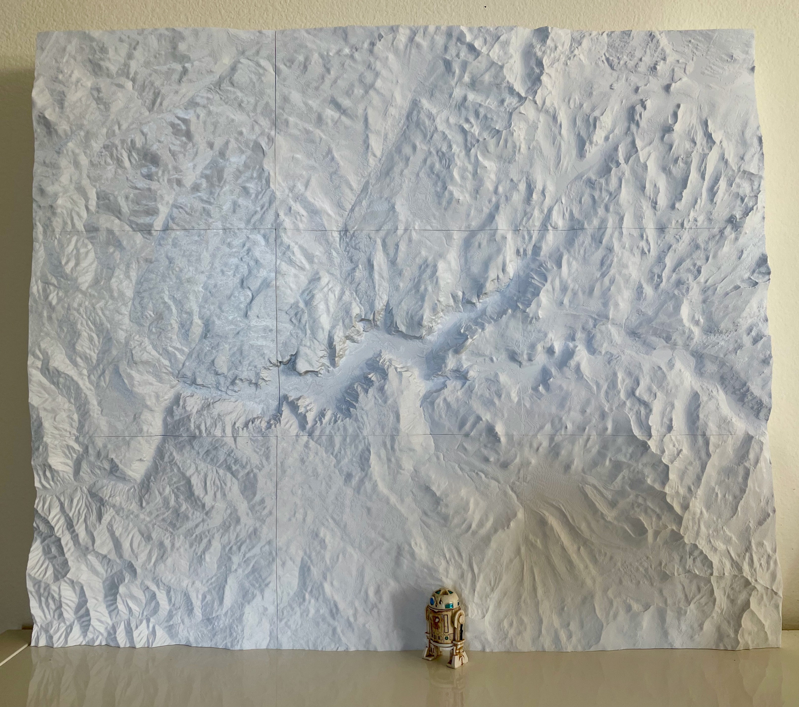
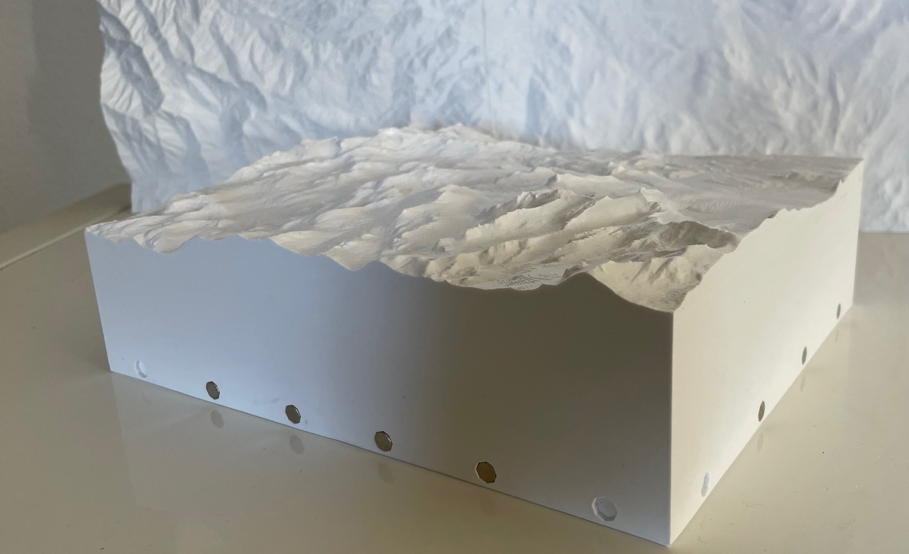

# landscape2stl: High resolution terrain models for 3D printing


[Source](https://github.com/gecrooks/landscape2stl)


Gavin E. Crooks (2023)



Yosemite valley and environs, scale about 1" to 1 mile, overall size 24"x21". R2D2 for scale.


Yosemite was printed in 9 segments, held together by magnets installed along the base.


The python script landscape2stl.py generates large scale terrain models as STL files suitable for 3D printing. I have
incorporated a number of innovations, namely a high resolution data source, novel map projection, and base alignment magnets.

Install dependencies,

    > pip install -r requirements.txt

then create STL terrain models.

    > python -m landscape2stl --preset half_dome


## Data Source: 3DEP 1/3rd arc-second

The elevation data is taken from the USGS 3D Elevation Program (3DEP) 1/3rd arc-second dataset (approximately 10m resolution). This
is a high quality, high resolution dataset. I've experimented printing with scales up to 1:24000, and the models look great. (If the 
dataset resolution isn't fine enough the model starts looking like Minecraft.)

The downside is that this dataset is only available for the contiguous 48 states, Hawaii, and some parts of Alaska.

## There is no projection

When you print a 2D map of a portion of the world you have to choose a map projection, since the world is spherical and the map is flat. There are many possible projections, and no projection is ideal since they must all inevitable distort the spherical reality to the flat plane.

While I was pondering the problem of which projection would be best for terrain models, a flash of inspiration hit me: I don't need a projection at all! With a 3D printer I can print in 3D! Each terrain segment created by landscape2stl.py is a gently curved wedge of the Earth. The sides slope inwards slightly, and the east-west lines of longitude are curved. At large scales this effect is subtle, but not insignificant even at a scale of 1 miles: 1 inch.


## Base alignment magnets

Since print beds are limited in size large landscapes have to be printed as a collection of segments. However, getting neighboring segments to line up satisfactorily can be tricky.

Inspired by the gridfinity project, I solved the alignment problem by adding holes along the base into which you can press-fit 6mm X 2mm
magnets. (I'm using DIYMAG brand from Amazon, which cost about 3¢ each.) Neighboring segments snap together with a satisfying click, with nigh on perfect alignment, and can be broken apart again for storage or transport. 


## CLI: landscape2stl.py

```
> python -m landscape2stl.py --help

usage: landscape2stl.py [-h]
                        [--preset REGION]
                        [--scale SCALE] [--exaggeration EXAGGERATION] [--magnets MAGNETS]
                        [N W S E ...]

Create landscape STLs

positional arguments:
  N W S E               Latitude/longitude coordinates for slab (Order North edge, west edge, south edge, east edge)

options:
  -h, --help            show this help message and exit
  --preset REGION
  --scale SCALE         Map scale
  --exaggeration EXAGGERATION
                        Vertical exaggeration
  --magnets MAGNETS     Magnet spacing (in degrees)
  --name FILENAME 

```

###  N W S E               

Latitude/longitude coordinates for slab (Order North edge, west edge, south edge, east edge)

### Preset
A collection of pre-selected regions that override explicit selection of coordinates.  These regions
were used for development and illustration. Take a look at the code to see what the options are. 

### Scale
Common scales for US maps include:
*    1:24_000,  1" = 2000', about 2.5" to 1 mile
*    1:62_500,   about 1" to 1 mile
*    1:125_000,   about 1" to 2 miles
*    1:1_000_000,  about 1" to 16 miles


### Exaggeration

Low scale models require vertical exaggeration else the landscape looks flat and uninteresting. Exaggeration isn't needed at scales of 1:125_000 or higher. Opinions vary as to appropriate exaggeration, but at 1:1_000_000 an exaggeration of 2:1 looks OK. (Just don't go the way of NASA when showing pictures of Maat Mons)


### Magnet spacing
The spacing between magnets in degrees. If you use a standard scale a reasonable magnet spacing will be chosen for you. Set to 0.0 
to disable magnets.


## Slicing and Printing

* Printer: Ender 3 pro
* Nozzle: 0.4mm
* Layer height: 0.12mm
* Infill: 5% 
* Filament: eSUN PLA PRO (PLA+), Cool White (print at 210c, 70c plate temperature)

The filament I used is a bright, opaque white that highlights details by throwing valleys and folds into shadow.

With a layer height of 0.12mm contour lines are approximately 25' apart at a scale of 1" : 1 mile.

Bed adhesion is important since there is a tendency for larger prints to warp upwards at the corners.
Upper layers may self-correct, but the base and magnets will be out of alignment. After some frustration here are
the steps I took to ensure success.

1) Carefully level the bed.
2) Print with a brim (easily removable with a deburring tool).
3) Increase plate temperature (I'm currently using 70c)
4) Use a glass build plate and spray adhesive (3DLAC Printer Adhesive).
5) Monitor the first layers, and abort if there is a failure to adhere.

After printing, use a deburring tool to clean up bottom edges, lightly sand the sides, and press-fit the magnets. Make sure the magnet orientations are consistent. I use the same orientation on North and East edges, and flip the orientation for the south and west edges. Make sure to use the same magnet orientations for each additional slab. 

To fit the magnets, take a stack of magnets, place over the magnet hole (in the correct orientation), and give the top of the stack a sharp tap with a mallet. If the magnet won't stay in its socket, add a small spot of superglue. 


## Known Issues

### Experimental Prototype

This is an experimental prototype package of beta code for my own amusement. There is no support. Use at your own risk. Caveat emptor.


### Limited data coverage

The 3DEP 1/3 arc second data set only covers the USA (And not even all of Alaska). Ideally we would fall back to other lower resolution datasets for the rest of the world.


### Model arcs

Large enough models arc upwards due to the curvature of Earth's surface. The magnets are not strong enough to hold the arc themselves, so it may be necessary to add shims to support the middle segments of the arch.


### Flat base edges

The method for adding the magnet holes is an ugly hack. As a simplification, the surface that the magnets are embedded into is flat. That's correct for the North-South edges, but the East-West edges of the terrain actually curve, creating an odd break between the base and the heights. This can be seem in the Denali preset (Since Denali is far north the curvature of lines of longitude is more pronounced).

In practice, this mismatch between base and heights doesn't seem to be a problem, but the current solution is inelegant and should be rewritten using proper computational geometry.


### Shorelines

Shorelines are generally not visible in the models.

(A possible fix would be to reduce the height of the ocean by some number of meters. Unfortunately the 3DEP dataset does not make it clear where land ends and the sea begins. You might think everything above sea level is land, but that produces bad looking coast lines. Setting sea level to 1m  oddly produces better results, but not ideal. And also some areas of California, notable Death Valley, are below sea level.)


### Circular Contours

At the center of each terrain segment up is vertical, but at the edges of the segment up is slightly outwards because each segment is curved. This means the contour lines created by the successive layers of the 3D print are not actually horizontal. This is visible if you create a model of a very flat area, such as a patch of ocean. You get circular contour lines centered at the center of the segment. However, this effect isn't noticeable for any interestingly rugged piece of terrain. 


