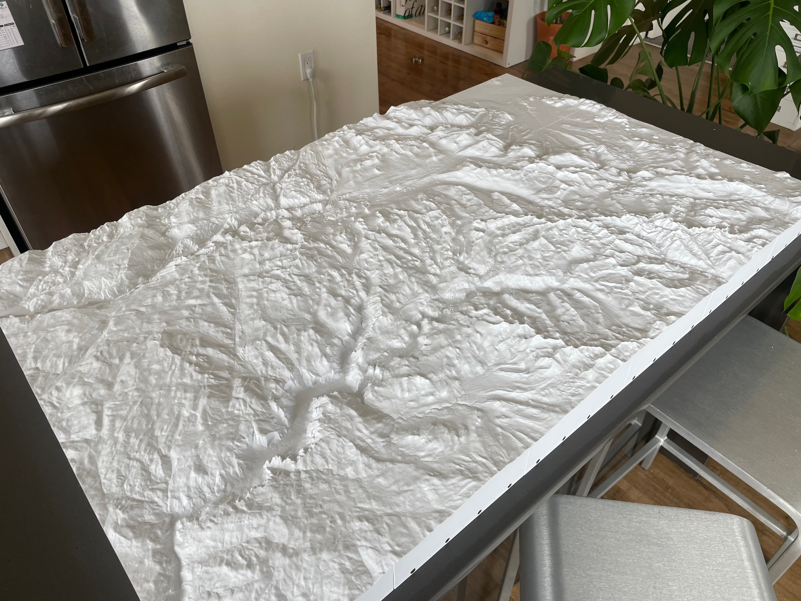

# landscape2stl: Modular, high resolution terrain models for 3D printing


[Source](https://github.com/gecrooks/landscape2stl)


Gavin E. Crooks (2024)



Yosemite valley and environs, scale about 1" to 1 mile, overall size 42"x43" (a little over 1 square meter). 


Yosemite was printed in 30 segments, held together by magnets installed along the base.


The python script landscape2stl.py generates large scale terrain models as STL files suitable for 3D printing. I have
incorporated a number of innovations, notably a high resolution data source and base alignment magnets.

Install dependencies,

    > pip install -r requirements.txt

then create STL terrain models.

    > python -m landscape2stl --preset half_dome


## Data Source: 3DEP 1/3rd arc-second

The elevation data is taken from the USGS 3D Elevation Program (3DEP) 1/3rd arc-second dataset (approximately 10m resolution). This
is a high quality, high resolution dataset. I've experimented printing with scales up to 1:24000, and the models look great. (If the 
dataset resolution isn't fine enough the model starts looking like Minecraft.)

The downside is that this dataset is only available for the contiguous 48 states, Hawaii, and some parts of Alaska.


## Base alignment magnets

Since print beds are limited in size large landscapes have to be printed as a collection of segments. However, getting neighboring segments to line up satisfactorily can be tricky.

Inspired by the gridfinity project, I solved the alignment problem by adding holes along the base into which you can press-fit 6mm X 2mm
magnets. (I'm using DIYMAG brand from Amazon, which cost about 5¢ each.) Neighboring segments snap together with a satisfying click, with nigh on perfect alignment, and can be broken apart again for storage or transport. 

I've also added smaller holes along the sides for alignment pins (Use metal pins, or short lengths of filament).


## CLI: landscape2stl.py

```
> python -m landscape2stl --help

usage: landscape2stl.py [-h] 
                        [--preset {half_dome,west_of_half_dome,whitney,grand_canyon,shasta,shasta_west,joshua_tree,owens_valley,denali}] [--quad QUAD]
                        [--state STATE]
                        [--scale SCALE]
                        [--exaggeration EXAGGERATION]
                        [--resolution {10,30}]
                        [--magnets MAGNETS]
                        [--name NAME] [-v]
                        [S W N E ...]

Create quadrangle landscape STLs

positional arguments:
  S W N E               Latitude/longitude coordinates for quadrangle (Order south edge, west edge, north edge, east edge)

options:
  -h, --help            show this help message and exit
  --preset {half_dome,west_of_half_dome,whitney,grand_canyon,shasta,shasta_west,joshua_tree,owens_valley,denali}
  --quad QUAD
  --state STATE
  --scale SCALE         Map scale
  --exaggeration EXAGGERATION
                        Vertical exaggeration
  --resolution {10,30}  DEM resolution
  --magnets MAGNETS     Magnet spacing (in degrees)
  --name NAME           Filename for model
  -v, --verbose
```

###  S W N E               

Latitude/longitude coordinates for slab (Order south edge, west edge, north edge, east edge)


### Preset
A collection of pre-selected regions that override explicit selection of coordinates.  These regions
were used for development and illustration. Take a look at the code to see what the options are. 

### Quad
Alternatively give the name of a USGS 7.5 minute quadrangle map. This will print at 1:62_500 scale.

One resource to find the name of quadrangle maps is https://livingatlas.arcgis.com/topomapexplorer/
(Select 1:24_000 scale for 7.5 minute maps.)

### Scale
Common scales for US maps include:

* 1:1_000_000       Approx 1 inch: 16 miles       2° x 2°             144 x 112 miles
* 1:250_000         Approx 1 inch: 4 miles        1/2° x 1/2°         
* 1:62_500          Approx 1 inch: 1 mile         1/8° x 1/8°         9 x 7 miles
* 1:24_000          1" = 2000', about 2.5" to 1 mile  
* 1:15_625          Approx 4 inches: 1 mile       1/32° x 1/32°       2 1/4 x 1 3/4 miles

Alos listed are the approximate scale in inches per mile, the latitude and longitude extend of the quadrangle that will fit on a 256mm x 256mm print bed, and the approximate scaled size in miles. 


### Exaggeration

Low scale models require vertical exaggeration else the landscape looks flat and uninteresting. Exaggeration isn't needed at scales of 1:125_000 or higher. Opinions vary as to appropriate exaggeration, but at 1:1_000_000 an exaggeration of 3:1 looks OK. (Just don't go the way of NASA when showing pictures of Maat Mons) If not set explicitly, the exaggeration is set using a heuristic based on the scale.


### Magnet spacing
The spacing between magnets in degrees. If you use a standard scale a reasonable magnet spacing will be chosen for you.


## Slicing and Printing

* Printer: Bambu Lab P1S
* Nozzle: 0.4mm
* Layer height: 0.08mm
* Infill: 8% 
* Filament: eSUN PLA PRO (PLA+), Cool White (Sometimes described as Cold White)
* Brim (for bed adhesion)

The filament I used is a bright, opaque white that highlights details by throwing valleys and folds into shadow.

With a layer height of 0.08mm contour lines are approximately 15' apart at a scale of 1" : 1 mile.

After printing, use a deburring tool to clean up bottom edges, lightly sand the sides, and press-fit the magnets. Make sure the magnet orientations are consistent. I use the same orientation on North and East edges, and flip the orientation for the South and West edges. Make sure to use the same magnet orientations for each additional slab. 

To fit the magnets, take a stack of magnets, place over the magnet hole (in the correct orientation), and give the top of the stack a few lights tap with a mallet. If the magnet won't stay in its socket, add a small spot of superglue. 


## Known Issues

### Experimental Prototype

This is an experimental prototype package of beta code for my own amusement. There is no support. Use at your own risk. Caveat emptor.


### Limited data coverage

The 3DEP 1/3 arc second data set only covers the USA (And not even all of Alaska). Ideally we would fall back to other lower resolution datasets for the rest of the world.


### Shorelines

We drop ocean areas by a small amount to make shorelines more visible in the models. Unfortunately the 3DEP dataset does not make it clear where land ends and the sea begins. You might think everything above sea level is land, but that produces bad looking coast lines. Setting sea level to 1m  oddly produces better results, but not ideal. And also some areas of California, notable Death Valley, are below sea level. And sea is not always at 0m. I've added some heutistics to generate shores lines, but they are under-tested. Use at your own risk.


